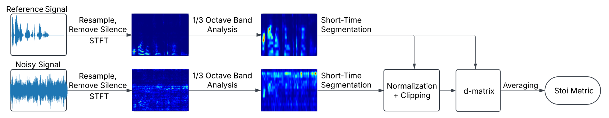
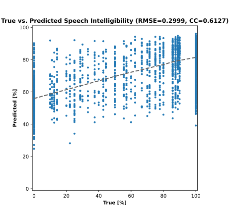
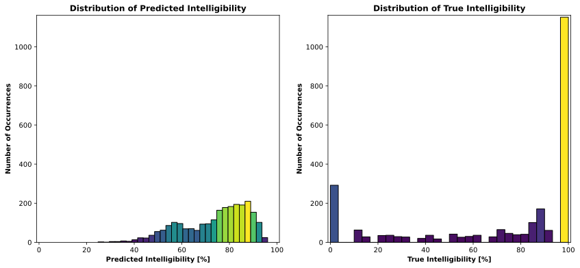

# Short-Time Objective Intelligibility (STOI) Metric

This repository contains an implementation of the STOI metric[^1], an intrusive objective measure used to predict speech intelligibility in noisy environments. The STOI metric is widely used in evaluating the effectiveness of hearing aid algorithms, speech enhancement systems, and machine learning-based intelligibility predictors.

This implementation was developed as part of a B\.Sc. thesis, and the STOI-derived d-matrices were later used as inputs for [neural networks](https://github.com/George-P-1/Speech_Intelligibility_with_Neural_Networks).

---

## Overview of the STOI Metric

The STOI metric is a computationally efficient way to predict speech intelligibility based on the correlation of short-time temporal envelopes of clean and noisy speech.

<!-- Schematic of the STOI Process: -->
<div align="center">
    
</div>

It follows these main steps:
1. **Preprocessing**  
   - Converts audio to mono and resamples to 10 kHz.  
   - Removes silent frames based on an energy threshold.

2. **Time-Frequency Analysis**  
   - Computes the Short-Time Fourier Transform (STFT).  
   - Groups STFT bins into one-third octave bands (mimicking human auditory perception).

3. **Short-Time Segmentation**  
   - Divides signals into overlapping 30-frame windows.  
   - Normalizes and clips noisy speech based on reference signal energy.

4. **D-Matrix Computation**  
   - Calculates frame-wise correlation between clean and noisy signals.  
   - Stores these correlations in a structured d-matrix.

5. **Final STOI Score**  
   - Averages all correlation values to get the final STOI intelligibility score.


---

## Experimental Results

The dataset used to test the metric is the [CPC1 dataset](https://claritychallenge.org/docs/cpc1/cpc1_download), which includes noisy speech signals and corresponding intelligibility scores obtained from tests with human listeners.
<div align="center">
    
    
</div>

---

### Installation

Clone the repository:

```bash
git clone https://github.com/George-P-1/stoi_Metric.git
cd stoi_Metric
```

### Prerequisites

See *requirements.txt* for the necessary dependencies.
To install the necessary dependencies, run:

```bash
pip install -r requirements.txt
```

---

## Further Work
Use neural networks to improve predictions (see [neural networks project](https://github.com/George-P-1/Speech_Intelligibility_with_Neural_Networks)).

## Acknowledgements
The dataset used to test STOI metric was provided by [The Clarity Project](https://claritychallenge.org). The official [pystoi](https://github.com/mpariente/pystoi) implementation was used for validation of this work. 

[^1]: Cees H. Taal, Richard C. Hendriks, Richard Heusdens, and Jesper Jensen. “An Algorithm for Intelligibility Prediction of Time-Frequency Weighted Noisy Speech”. In: IEEE Transactions on Audio, Speech, and Language Processing 19.7 (Sept. 2011), pp. 2125–2136. doi: 10.1109/TASL.2011.2114881.